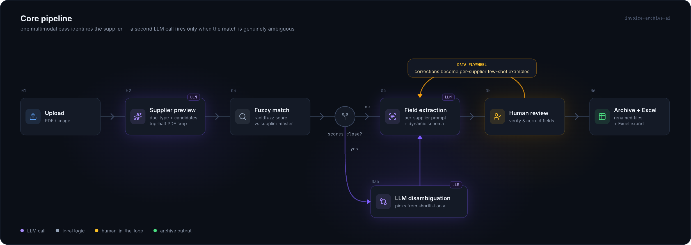

# Invoice Archive AI

A self-hosted web app that ingests supplier invoices (PDF / image), uses a
multimodal LLM to **recognize the supplier and extract structured fields**, routes
low-confidence cases to a human, and archives + exports the results to renamed
files and Excel.

The interesting part isn't "call an LLM on an invoice" — it's everything around it:
supplier identification against a large master list, a **cost-aware two-stage matcher**
that only spends a second LLM call when the answer is genuinely ambiguous, per-supplier
prompt specialization, a human-in-the-loop correction loop that feeds a data flywheel,
per-call cost/latency telemetry, and a **reproducible evaluation harness with confidence
intervals**.

> Self-hosted and in production use in a real purchasing workflow.

- **Backend:** Python · FastAPI · SQLite · Google Gemini on Vertex AI (`google-genai`)
- **Frontend:** React · TypeScript · Vite · Tailwind
- **LLM ops:** Pydantic-validated structured output · per-call token/cost telemetry · LangSmith tracing · reproducible eval harness



---

## What it does

1. **Supplier preview (per upload).** One multimodal call classifies the document
   type (invoice / statement / PO / remittance …) and proposes vendor-name
   candidates. Candidates are fuzzy-matched (`rapidfuzz`) against the supplier master;
   near-ties trigger a second LLM call that picks from the shortlisted options only.
2. **Field extraction.** For confirmed invoices, fields are extracted with a
   **per-supplier prompt** — each supplier group can carry its own instructions and
   output schema; unknown suppliers fall back to a default schema.
3. **Human-in-the-loop.** Corrections are captured as labels and recycled into
   per-supplier few-shot examples *and* eval ground truth — a small data flywheel.
4. **Archive + export.** Confirmed invoices are renamed and exported alongside an
   Excel sheet with configurable columns.

## Getting started

### Credentials

The app calls Gemini on Vertex AI, so you need a Google Cloud service account:

1. Create a service account with **Vertex AI** access and download its JSON key.
2. Save the key at **`secrets/gemini-service-account.json`** — the app looks there by
   default, and the folder is git-ignored so it never gets committed.
3. Copy `.env.example` to `.env` and set `GOOGLE_CLOUD_LOCATION` (the project is read
   from the key automatically). Every key in `.env.example` is documented inline.

> Just want to look around? The Docker demo-data path below seeds a fully populated app
> with **no credentials required**.

### Docker (fastest — includes optional demo data)

The app ships as a single container (frontend built and served with the API on one
port). Use the launcher:

```bash
cp .env.example .env            # fill in the values (each key is documented in the file)
mkdir -p secrets exports        # your SA JSON goes at secrets/gemini-service-account.json
./start.sh                      # Windows: start.cmd
```

`start.sh` prompts **"Load demo data? [y/N]"**. Yes seeds a prebuilt snapshot (sample
invoices already recognized/confirmed + a supplier master), so you can explore a
populated app immediately — **no Google credentials needed just to look around**. The app
is served at http://localhost:8000.

### Backend (local dev)

```bash
cd backend
python -m venv .venv && source .venv/bin/activate   # Windows: .\.venv\Scripts\Activate.ps1
pip install -r requirements.txt
uvicorn app.main:app --reload --host 127.0.0.1 --port 8000
```

Authentication resolution order (see [`backend/app/llm/gemini.py`](backend/app/llm/gemini.py)):

1. `GOOGLE_APPLICATION_CREDENTIALS` (service-account JSON) → Vertex AI *(recommended)*
2. Local ADC (`gcloud auth application-default login`) + `GOOGLE_CLOUD_PROJECT` → Vertex AI
3. `GEMINI_API_KEY` (AI Studio) → local dev only

### Frontend (local dev)

```bash
cd frontend
npm install
npm run dev        # proxies /api to http://127.0.0.1:8000
```

`app.main` also mounts `frontend/dist` at `/` when present, so a production build is
served from the same port as the API.

---

## Highlights

| Area | What's implemented |
|---|---|
| **Cost-aware supplier ID** | LLM proposes vendor candidates → `rapidfuzz` composite scoring (token-set/sort + core-token overlap, generic-word penalties) → a **second LLM call fires only when the top scores fall within a margin**. On clean data it never fires; on ambiguous names it does. |
| **Structured output** | Response schema is built *at runtime* from the per-supplier field config (`create_model`), then parsed and validated with Pydantic — with coercions for money/date formats and `extra="allow"` so unexpected keys survive. |
| **Data flywheel (HITL)** | Human corrections are stored with the model's original output and the field-level diff, then reused as per-supplier few-shot examples and auto-generated eval ground truth. |
| **Token thrift** | Text-PDFs are detected and cropped to the top half (where the issuer block sits) before the vision call. |
| **Reliability** | Provider errors are classified (rate-limit / transient / timeout / validation) and retried with exponential backoff + jitter; only retryable classes are retried. |
| **Observability** | Per-call token usage, cost and latency logged to SQLite with business dimensions (supplier / stage / prompt version); optional LangSmith tracing that maps to the LLM run type and strips image bytes. |
| **Evaluation** | A headless harness runs the **production extraction code path** over a labeled set and reports per-field accuracy with Wilson 95% confidence intervals. |
| **Provider abstraction** | `LLMClient` ABC with a native Gemini client (production) and a LiteLLM-backed client. |

## Evaluation

The pipeline is measured with a headless, reproducible harness
([`evaluation/scripts/`](evaluation/scripts)). It runs the **production extraction
code path** — not a re-implementation — over a labeled set, normalizes values
(US/EU money formats, dates, ID whitespace), and reports per-field accuracy with a
**Wilson 95% confidence interval**. Fields with no ground-truth label are excluded
from their denominator rather than counted as failures.

**Public benchmark — [katanaml/invoices-donut-data-v1](https://huggingface.co/datasets/katanaml-org/invoices-donut-data-v1) (MIT), n = 100 synthetic invoices:**

| Task | Metric | Accuracy |
|---|---|---|
| Field extraction | `invoice_number` | 100% (99/99) |
| | `invoice_date` | 99% (99/100) |
| | `total_amount` | 100% (99/99) |
| | all fields correct | 99% (99/100) |
| Supplier identification | correct `vendor_code` (master of 418) | 100% (100/100) |

> _A private, real-world set (scanned documents, near-duplicate supplier names) is scored
> separately; those figures are compiled from production review labels via
> [`backend/evals/refresh_from_review_labels.py`](backend/evals/refresh_from_review_labels.py)._

### Reproduce

```bash
# Field-extraction eval on the committed 20-invoice demo set (no download needed)
python evaluation/scripts/run_demo_eval.py --data-dir evaluation/invoices-donut-demo

# Supplier-identification eval on the same set
python evaluation/scripts/run_supplier_eval.py --data-dir evaluation/invoices-donut-demo

# Full 100-invoice benchmark (fetches images + ground_truth.jsonl first)
python evaluation/scripts/fetch_dataset.py --split train --n 100 --out evaluation/scoring-set
python evaluation/scripts/run_demo_eval.py --data-dir evaluation/scoring-set
```

## Cost & latency

Measured from the built-in telemetry on `gemini-3.1-flash-lite` (Vertex AI paid tier,
$0.25 / $1.50 per 1M input/output tokens):

- **≈ $0.0013 per invoice, end-to-end** — supplier preview + field extraction. The
  conditional disambiguation call fires only on ambiguous names (0× on the clean
  synthetic set), so it adds nothing on the easy cases.
- **≈ $1.30 per 1,000 invoices** — effectively a rounding error at any realistic volume.
- **~2.8 s** average latency per extraction call.

Every call's token count, cost and latency is written to SQLite, so these numbers come
from real usage rather than an estimate.

---

## Repository layout

```
backend/
  app/
    llm/          # provider clients, schema builder, pricing, telemetry, tracing
    services/     # invoice_extractor, supplier_matcher, supplier_preview_extractor,
                  # auto_archive, exporter, few_shot, response validation
    main.py       # FastAPI app + routes
    database.py   # SQLite schema + migrations
  evals/          # manifest-driven eval runner, review-label -> golden-set builder
  tests/          # unit + integration tests
frontend/src/
  pending/ review/ confirmed/ rules/   # upload, HITL review, archive, config UIs
evaluation/
  invoices-donut-demo/   # committed 20-invoice demo set (runs with no download)
  scripts/               # headless eval harness (fetch, field eval, supplier eval)
Dockerfile               # multi-stage build: frontend + API in one image
docker-compose.yml       # single-container deploy + optional demo-data loader
```

## Notes

- **Self-hosted and single-tenant by design:** invoices, the SQLite DB, and uploads
  stay on the company's own machine (`data/`, git-ignored). No third-party SaaS.
- **Testing:** the backend has 150+ unit and integration tests (services, LLM layer,
  API routes, DB migrations); the eval harness above covers the extraction pipeline
  end-to-end.
- No real supplier data or credentials are included in this repository; the sample
  data is synthetic and MIT-licensed.
